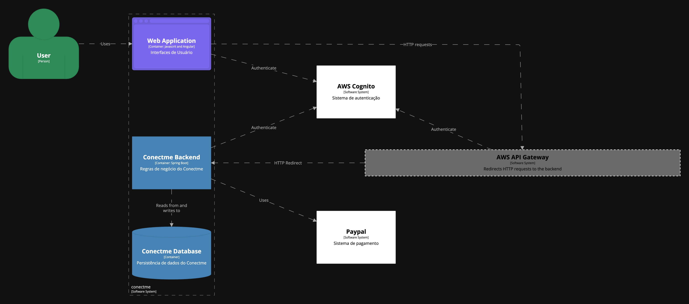
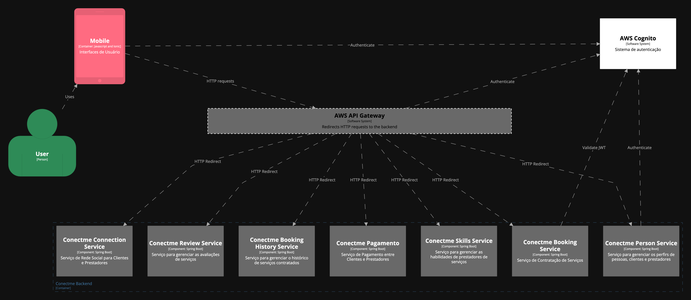
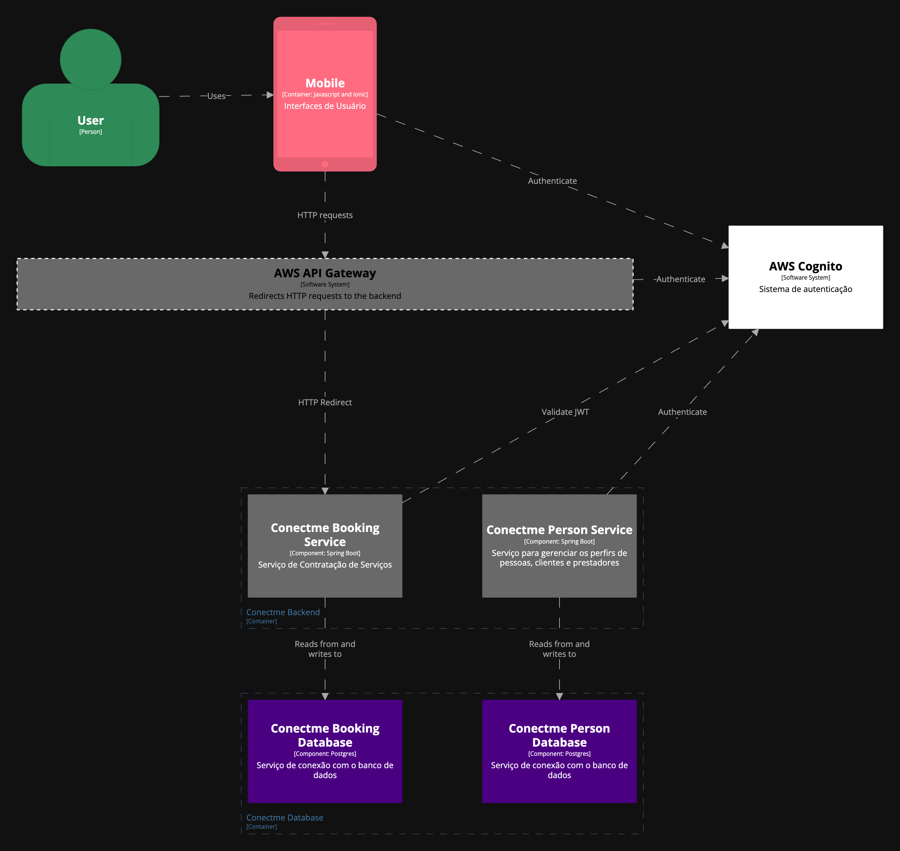
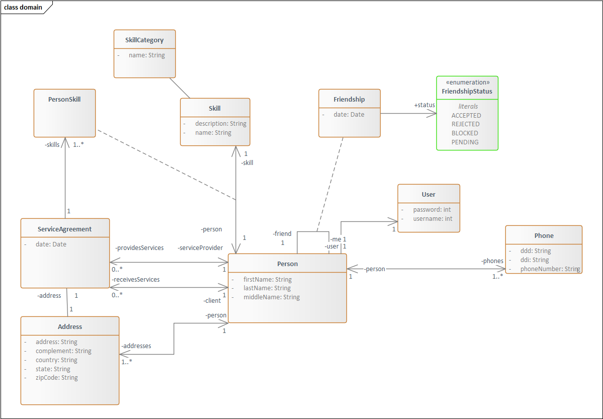
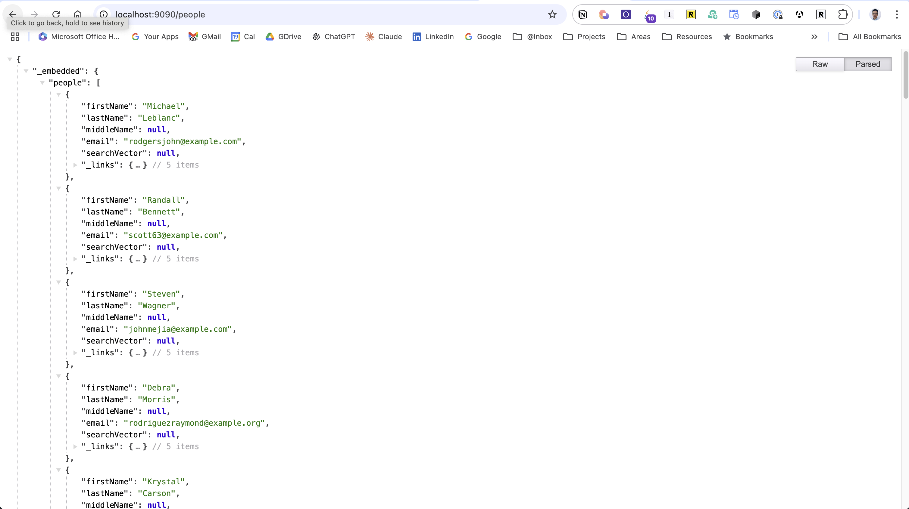
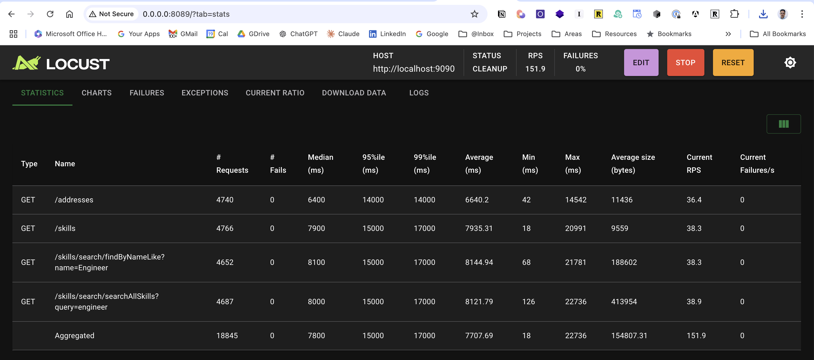

# connect-me-api
## Contexto
Em um país em desenvolvimento, as atividades de prestação de serviços gerais, como faxineiras, bombeiros, jardineiros, piscineiros, eletricistas, pintores, enfermeiros e babás, são amplamente demandadas pela população. No entanto, tanto os profissionais quanto os clientes enfrentam desafios significativos na conexão e organização desses serviços. 

Muitos dos profissionais que atuam nessas áreas fazem parte da economia informal e frequentemente possuem mais de uma ocupação para complementar sua renda, o que torna a organização da agenda e a venda de seus serviços um desafio constante. Por outro lado, os clientes encontram dificuldades em localizar profissionais qualificados e em obter referências de confiança para garantir a qualidade do serviço contratado.

Esse contexto evidencia a necessidade de uma solução que facilite a intermediação entre prestadores de serviços gerais e seus clientes, promovendo a democratização do acesso a plataformas de venda de serviços. Uma plataforma que não apenas organize e simplifique a agenda dos profissionais, mas também permita que clientes encontrem e contratem serviços de forma mais rápida e segura, com base em referências e avaliações verificadas.
## Problema a Ser Resolvido
Atualmente, a falta de uma plataforma centralizada e acessível que conecte de forma eficiente os profissionais de serviços gerais com seus clientes é um problema recorrente. A informalidade e a multiprofissionalidade dos trabalhadores dificultam o gerenciamento de suas atividades, enquanto os clientes enfrentam barreiras para encontrar serviços confiáveis e bem referenciados. Essa situação impacta diretamente na produtividade dos prestadores de serviços e na satisfação dos consumidores.
## Motivação
A motivação para o desenvolvimento deste projeto está baseada na necessidade de criar uma solução acessível e abrangente que democratize o acesso à contratação de serviços gerais. O projeto visa proporcionar aos profissionais um meio de organizar suas agendas e ampliar suas oportunidades de trabalho, ao mesmo tempo em que oferece aos clientes uma forma mais eficaz de encontrar e contratar profissionais com base em avaliações autênticas e detalhadas. Benefícios esperados incluem maior transparência no mercado de serviços, otimização do tempo de busca e contratação e um aumento na segurança e confiança de ambas as partes.
## Objetivo Geral e Específicos
### Objetivo Geral
Desenvolver uma plataforma que facilite a conexão entre profissionais de serviços gerais e clientes, promovendo a organização, a visibilidade e a eficiência na contratação de serviços.
### Objetivos Específicos
- Criar uma interface intuitiva que permita aos profissionais gerenciarem suas agendas e disponibilizarem seus serviços.
- Desenvolver um sistema de avaliação e referências para garantir a qualidade e a confiabilidade dos serviços.
- Implementar um módulo de comunicação integrado que facilite a interação entre clientes e prestadores de serviços.
- Promover a inclusão digital de trabalhadores informais, fornecendo uma plataforma acessível e segura para ampliação de suas atividades.
- Criar uma rede social entre os trabalhadores e clientes que indique as relações de serviços existentes e o histórico de serviços prestados.
- Desenvolver um sistema de busca por localidade com raio de localização e busca por categoria de serviços.
- Estabelecer tipos de conexão entre membros, como vizinhança, parentesco ou outras relações relevantes.
## ConnectMe
ConnectMe é uma plataforma de rede social que conecta usuários com base em suas habilidades e serviços. Os usuários podem encontrar e reservar serviços de outros usuários, gerenciar suas habilidades e construir uma rede de conexões. A plataforma é projetada como um conjunto de microsserviços que lidam com diferentes aspectos da rede social, como gerenciamento de usuários, catalogação de serviços, reservas e gerenciamento de conexões.

Este é um MVP com o propósito de validar alguns conceitos, requisitios não funcionais, alguns atributos de qualidade e a arquitetura de microsserviços, tanto quanto avaliar a arquitetura usando ATAM.

Para simplificação do MVP e das primeiras versões do sistemas os microserviços são organizadas em um único artefato e implementadas como um monolítico, onde cada microserviço representa um pacote no código fonte.

https://github.com/user-attachments/assets/beb84c24-d692-4c49-b0f7-1faa2f73e32a

## Definição de Personas

## User Journeys

## Visão Geral dos Microsserviços e Fluxo de Dados
Cada serviço deve ter seu próprio banco de dados, permitindo escalabilidade e isolando a lógica de domínio.

Nas primeiras versões cada pacote usa um um DB diferente na mesmo servidor Postgres, tendo um `Data Source` por pacote;

- User Service: Lida com perfis de usuário, pessoas, endereços, ...
- Skill Management Service: Contém habilidades e categorias de uma pessoa.
- Booking Service: Gerencia solicitações de serviços e reservas.
- Work History Service: Armazena todas as transações de serviços entre usuários.
- Connection Service: Gerencia o gráfico de conexões da rede social.
- Payment Service: Lida com pagamentos e transações financeiras.
- ...

## Restrições Arquiteturais
As restrições relacionadas a frameworks e linguagens de programação estão relacionadas as habilidades do time de desenvolvimento;

- R1 O sistema deve ser desenvolvido com tecnologias web modernas, utilizando um framework como Angular.io para a interface do portal web e Ionic para o aplicativo móvel.
- R2: O backend deve ser implementado em Spring Boot, garantindo uma arquitetura escalável e orientada a serviços.
- R3: A base de dados deve ser em um sistema que suporte alta escalabilidade, como Postgres, para armazenar informações de usuários, serviços e históricos.
- R4: O sistema deve seguir boas práticas de segurança e LGPD (Lei Geral de Proteção de Dados), garantindo a privacidade dos dados dos usuários.
- R5: O sistema de busca e geolocalização deve ser implementado com a API do Google Maps para assegurar a precisão e eficiência.
## Requisitos Funcionais
| **ID**   | **Descrição Resumida**                                                                 | **Dificuldade (B/M/A)** | **Prioridade (B/M/A)** |
|----------|----------------------------------------------------------------------------------------|-------------------------|-------------------------|
| **RF01** | O sistema deve permitir o cadastro de profissionais e clientes com perfis diferenciados. | M                       | A                       |
| **RF02** | Os usuários devem poder gerenciar e atualizar suas agendas de serviços.               | M                       | A                       |
| **RF03** | O sistema deve permitir a busca de profissionais por localidade e tipo de serviço com raio de localização. | A                       | A                       |
| **RF04** | A plataforma deve fornecer um histórico de serviços realizados para consulta.         | M                       | M                       |
| **RF05** | Implementar uma rede de conexões que permita aos usuários visualizar relações de vizinhança ou parentesco. | A                       | M                       |
| **RF06** | Integrar um sistema de comunicação por mensagens e e-mails entre os profissionais e clientes. | A                       | A                       |
| **RF07** | Permitir que os clientes avaliem e deixem referências sobre os serviços recebidos.    | M                       | A                       |


*B=Baixa, M=Média, A=Alta.
Obs: acrescente quantas linhas forem necessárias.

## Requisitos Não Funcionais

| **ID**   | **Descrição**                                                                                     | **Prioridade (B/M/A)** |
|----------|--------------------------------------------------------------------------------------------------|-------------------------|
| **RNF01** | O sistema deve ter alta disponibilidade, operando 24/7.                                           | A                       |
| **RNF02** | O tempo de resposta para buscas de serviços deve ser inferior a 2 segundos.                      | A                       |
| **RNF03** | A plataforma deve garantir a segurança de dados pessoais por meio de criptografia.               | A                       |
| **RNF04** | O aplicativo móvel deve ter uma interface responsiva e amigável.                                 | M                       |
| **RNF05** | O sistema deve ser escalável para suportar aumento de usuários sem perda de desempenho.          | A                       |
| **RNF06** | Garantir que os dados de localização estejam precisos e atualizados.                             | M                       |

## Mecanismos Arquiteturais

<table>
    <tr>
        <th>Análise</th>
        <th>Design</th>
        <th>Implementação</th>
    </tr>
    <!-- Backend -->
    <tr>
        <td rowspan="5">Backend</td>
        <td>Arquitetura em Camadas</td>
        <td>
            - Divida a aplicação em camadas claras: Controller, Service, Repository.<br>
            - Utilize a Injeção de Dependência do Spring Boot para desacoplar essas camadas de forma flexível.
        </td>
    </tr>
    <tr>
        <td>API RESTful</td>
        <td>
            - Siga os princípios REST com o uso adequado dos verbos HTTP (GET, POST, PUT, DELETE).<br>
            - Implemente paginação, filtragem e ordenação para endpoints que retornam grandes volumes de dados.
        </td>
    </tr>
    <tr>
        <td>DTO (Objeto de Transferência de Dados)</td>
        <td>
            - Utilize DTOs para desacoplar o esquema do banco de dados dos contratos da API, garantindo flexibilidade
            para futuras alterações.
        </td>
    </tr>
    <tr>
        <td>Tratamento de Exceções</td>
        <td>
            - Centralize o tratamento de exceções usando @ControllerAdvice e @ExceptionHandler.
        </td>
    </tr>
    <tr>
        <td>Padrões de Resiliência</td>
        <td>
            - Implemente retries, circuit breakers e fallback usando bibliotecas como Resilience4j ou Hystrix.
        </td>
    </tr>
    <tr>
        <td rowspan="3">Frontend</td>
        <td>SPA (Single Page Application)</td>
        <td>
            - Utilize Angular para criar uma aplicação responsiva e dinâmica.<br>
            - Gerencie rotas com RouterModule e use componentes reutilizáveis.
        </td>
    </tr>
    <tr>
        <td>UX/UI Responsiva</td>
        <td>
            - Implemente responsividade com CSS Flexbox e Grid.<br>
            - Use bibliotecas como Angular Material ou Bootstrap para componentes de interface.
        </td>
    </tr>
    <tr>
        <td>Comunicação com Backend</td>
        <td>
            - Use HttpClientModule do Angular para consumir APIs REST.<br>
            - Configure interceptors para autenticação e tratamento de erros.
        </td>
    </tr>
    <tr>
        <td rowspan="2">Segurança</td>
        <td>Autenticação</td>
        <td>
            - Utilize Spring Security integrado com AWS Cognito para autenticação.<br>
            - Implemente JWT para controle de sessões e proteção de endpoints.
        </td>
    </tr>
    <tr>
        <td>Autorização</td>
        <td>
            - Defina papéis (roles) e permissões com base na lógica de negócios.<br>
            - Use @PreAuthorize para restringir acesso em métodos específicos.
        </td>
    </tr>
    <tr>
        <td rowspan="2">Integração</td>
        <td>Comunicação Síncrona</td>
        <td>
            - Utilize Feign Client ou RestTemplate para consumir APIs externas.<br>
            - Garanta que chamadas falhas sejam tratadas com retries.
        </td>
    </tr>
    <tr>
        <td>Comunicação Assíncrona</td>
        <td>
            - Implemente filas usando AWS SQS e tópicos com SNS.<br>
            - Use DLQs (Dead Letter Queues) para mensagens que falharam no processamento.
        </td>
    </tr>
    <tr>
        <td rowspan="2">Persistência</td>
        <td>Banco de Dados Relacional</td>
        <td>
            - Utilize PostgreSQL com Spring Data JPA para dados estruturados.<br>
            - Configure índices para otimizar consultas frequentes.
        </td>
    </tr>
    <tr>
        <td>Banco de Dados NoSQL</td>
        <td>
            - Use MongoDB para dados não estruturados ou semi-estruturados.<br>
            - Modele os documentos com base nos requisitos do domínio.
        </td>
    </tr>
    <tr>
        <td rowspan="2">Log</td>
        <td>Centralização de Logs</td>
        <td>
            - Use frameworks como Logback ou SLF4J para logging estruturado.<br>
            - Integre com ELK (Elasticsearch, Logstash, Kibana) ou CloudWatch.
        </td>
    </tr>
    <tr>
        <td>Monitoramento</td>
        <td>
            - Configure Spring Boot Actuator para métricas e health checks.<br>
            - Integre com Prometheus e Grafana para monitoramento em tempo real.
        </td>
    </tr>
    <tr>
        <td rowspan="2">Entrega</td>
        <td>Automação de Testes</td>
        <td>
            - Escreva testes unitários com JUnit e Mockito.<br>
            - Implemente testes de integração para APIs usando Spring Boot Test.
        </td>
    </tr>
    <tr>
        <td>CI/CD</td>
        <td>
            - Configure pipelines com GitHub Actions para build, teste e deploy automatizados.<br>
            - Use scripts para provisionar infraestrutura no Kubernetes.
        </td>
    </tr>
    <tr>
        <td>Deploy</td>
        <td>Contêineres e Orquestração</td>
        <td>
            - Utilize Docker para criar contêineres do aplicativo.<br>
            - Implemente Kubernetes no AWS EKS para orquestração e escalabilidade.
        </td>
    </tr>
</table>


## Modelagem Arquitetural

### Contexto


### Container



### Componentes


*Figure 3 – Diagrama de Componentes – Tem como objetivo mostrar os diferentes pacotes Java representando cada Microserviço da aplicação e as interações com outros componentes importante da Arquitetura.*

- Componentes do Container Conectme Backend – Cada microserviço será implementado como um pacote do backend Spring Boot – Connectme com objetivo de simplificar o MVP e as primeiras versões da solução, aumentando a probabilidade de aceitação e desenvolvimento da solução
- Sistema Externo – AWS Api Gateway – Utilizado para redirecionamento das requisições HTTP do aplicativo móvel e da solução web
- Sistema Externo – AWS Cognito – Utilizado para autenticação, autorização, autenticação de dois fatores e gerenciamento de Provedores de Identidade como Google, Azure AD, Facebook, entre outros;



*Figura 4 – Diagrama de Componentes – Tem como objetivo demonstrar um sub grupo dos componentes da aplicação e como eles interagem com outros sistemas, e componentes; As interações entre pacotes/microserviços devem ser melhor documentadas para a fase de separação dos pacotes em diferentes microserviços (artefatos, bancos de dados, implantações e ambientes; Nas fases posteriores as comunicações serão mais complexas e demandam o planejamento, análise e desenho de dos casos de dados distribuídos;*

### Domínio 




Cada domínio da aplicação:
- Habilidades
- Pessoas
- Agendamentos
- Amizades
- ...
Será implementado como um pacote de uma aplicação Java Spring Boot; Cada pacote foi desenvolvido de forma que possa ser extraído para um Microserviço de implantação independente, como um artefato;

Os pacotes devem incluir as classes de modelo/entidade, Interfaces de Repositório do Spring onde os conceitos independentes podem utilizar a biblioteca de Rest Repository do Spring; cada pacote deve conter as camadas de serviço e controller próprios do dóminio(eg: Pessoas, Amizades, ...)

- Component Person Service – Pacote Java que encapsula o domínio de Pessoas da aplicação – Pessoas, Endereços, Telefones, Usuários do Sistema
- Sistema Externo – AWS Api Gateway – Utilizado para redirecionamento das requisições HTTP do aplicativo móvel e da solução web
- Sistema Externo – AWS Cognito – Utilizado para autenticação, autorização, autenticação de dois fatores e gerenciamento de Provedores de Identidade como Google, Azure AD, Facebook, entre outros;

https://github.com/user-attachments/assets/32a8c0a4-fd7a-49f1-bd0d-ddeba2b16a8b

## Cenários ATAM
### Cenário 1: [Interoperabilidade](docs/cenarios/INTEROPERABILIDADE.md)



### Cenários 2: [Desempenho](docs/cenarios/DESEMPENHO.md)


*Execução de testes de carga com Locust feita em ambiente de desenvolvimento - localhost - cenário não apropriado - somente ilustrativo*

#### Como interpretar os resultados do Locust?
| Métrica               | Significado                                                                                   |
|-----------------------|-----------------------------------------------------------------------------------------------|
| # Requests           | Número total de requisições feitas ao endpoint durante o teste.                               |
| # Fails              | Número de requisições que falharam (devem ser 0 para atender aos objetivos).                   |
| Median (ms)          | Tempo de resposta mediano (50% das requisições foram mais rápidas que esse valor).             |
| 95%ile (ms)          | 95% das requisições foram mais rápidas que esse valor. Essa é uma métrica crítica para análise de desempenho. |
| 99%ile (ms)          | 99% das requisições foram mais rápidas que esse valor (analisa os piores cenários).            |
| Average (ms)         | Tempo médio de resposta de todas as requisições.                                               |
| Min (ms)             | O menor tempo de resposta observado (geralmente o ideal em um cenário de baixa carga).         |
| Max (ms)             | O maior tempo de resposta observado (relevante para identificar gargalos).                     |
| Current RPS          | Requisições por segundo (Requests Per Second) no momento do teste.                             |
| Current Failures/s   | Número de falhas por segundo no momento do teste (devem ser 0).                                |

**Processar 1000 RPS com <100ms de resposta:**
Foco em: Current RPS, Median (ms) e 95%ile (ms).

- Objetivo:
  - Current RPS ≥ 1000.
  - Median (ms) < 100ms.
  - 95%ile (ms) < 100ms.

**Responder ao input do usuário em ≤ 2 segundo sob carga:**
Foco em: Median (ms), 95%ile (ms), 99%ile (ms). Considerar que o tempo total de resposta percebido pelo usuário inclui a latência da rede, o tempo de renderização no cliente e o tempo de processamento no backend, podendo envolver múltiplas requisições e lógica complexa.

- Objetivo:
  - Median (ms) ≤ 2000ms.   
  - 95%ile (ms) ≤ 2000ms.
  - 99%ile (ms) deve estar próximo de 2 segundo (não pode exceder consistentemente).

#### Full-text Search
```plaintext
Bitmap Heap Scan on persons  (cost=13.59..312.28 rows=146 width=679) (actual time=0.067..0.406 rows=146 loops=1)
  Recheck Cond: (search_vector @@ '''john'''::tsquery)
  Heap Blocks: exact=109
  ->  Bitmap Index Scan on persons_search_idx  (cost=0.00..13.55 rows=146 width=0) (actual time=0.038..0.038 rows=146 loops=1)
        Index Cond: (search_vector @@ '''john'''::tsquery)
Planning Time: 0.325 ms
Execution Time: 0.436 ms
```
#### Regular Search
```plaintext
Seq Scan on persons  (cost=0.00..551.00 rows=142 width=679) (actual time=0.026..5.237 rows=154 loops=1)
Filter: ((firstname)::text ~~* '%John%'::text)
Rows Removed by Filter: 9846
Planning Time: 0.512 ms
Execution Time: 5.263 ms
```
### Cenário 3: [Modificabilidade](docs/cenarios/MODIFICABILIDADE.md)
```plaintext
➜  connect-me-api git:(main) ✗ tree -I 'build|bin|gradle|__pycache__|test|resources'
.
├── HELP.md
├── README.md
├── build.gradle
├── compose.yaml
├── db
│   ├── init-db
│   │   └── init-multiple-dbs.sql
│   ├── mock_data.py
│   ├── people-full-text-search.sql
│   └── skills-full-text-search.sql
├── gradlew
├── gradlew.bat
├── locustfile.py
├── requirements.txt
├── settings.gradle
└── src
    └── main
        └── java
            └── io
                └── zeecode
                    └── connectmeapi
                        ├── ConnectMeApiApplication.java
                        ├── config
                        │   ├── BookingDataSourceConfig.java
                        │   ├── ConnectionDataSourceConfig.java
                        │   ├── JpaConfig.java
                        │   ├── SkillManagementDataSourceConfig.java
                        │   └── UsersDataSourceConfig.java
                        ├── domain
                        │   └── BaseEntity.java
                        └── services
                            ├── auth
                            ├── booking
                            │   ├── model
                            │   │   ├── Person.java
                            │   │   ├── PersonSkill.java
                            │   │   ├── ServiceAgreement.java
                            │   │   ├── Skill.java
                            │   │   └── SkillCategory.java
                            │   └── repositories
                            │       └── ServiceAgreementRepository.java
                            ├── connection
                            │   ├── model
                            │   │   ├── Friendship.java
                            │   │   ├── FriendshipStatus.java
                            │   │   └── Person.java
                            │   └── repositories
                            │       └── FriendshipRepository.java
                            ├── review
                            ├── skillmanagement
                            │   ├── model
                            │   │   ├── Person.java
                            │   │   ├── PersonSkill.java
                            │   │   ├── Skill.java
                            │   │   └── SkillCategory.java
                            │   └── repositories
                            │       ├── PersonSkillRepository.java
                            │       ├── SkillCategoryRepository.java
                            │       └── SkillRepository.java
                            ├── user
                            │   ├── model
                            │   │   ├── Address.java
                            │   │   ├── Person.java
                            │   │   ├── Phone.java
                            │   │   └── User.java
                            │   └── repositories
                            │       ├── AddressRepository.java
                            │       ├── PersonRepository.java
                            │       ├── PhoneRepository.java
                            │       └── UserRepository.java
                            └── workhistory
```

### Cenário 4: [Escalabilidade](docs/cenarios/ESCALABILIDADE.md)
### Cenário 5: [Segurança](docs/cenarios/SEGURANCA.md)
### Cenário 6: [Disponibilidade](docs/cenarios/DISPONIBILIDADE.md)
